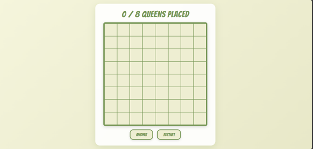
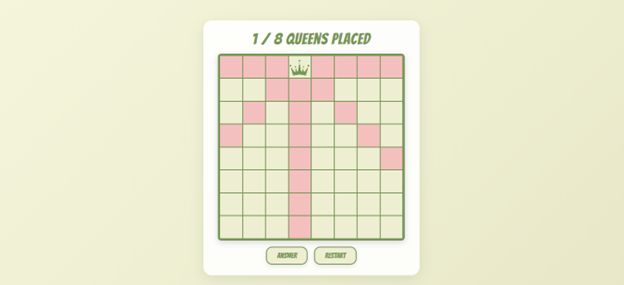
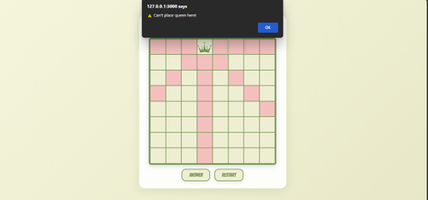
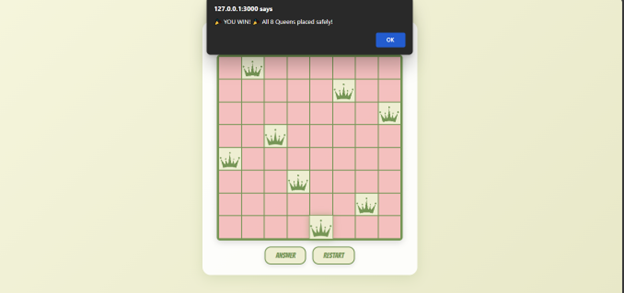
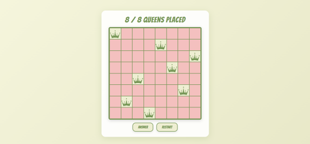

# 8Queens-Puzzle-Game

## Project Description
The **8 Queens Puzzle Game** is a web-based logic game where you place 8 queens on a chessboard so that none can attack each other (no two queens share the same row, column, or diagonal).  

This project was built using **HTML, CSS, and JavaScript** to practice my JavaScript skills and strengthen my logic-building abilities. It also helped me understand the algorithm for placing queens safely, which I studied in **Artificial Intelligence**(My course subject).


## Why I Created This Project
- To **practice JavaScript** in a hands-on way.  
- To understand the **algorithmic logic** behind the 8 Queens problem.  
- To improve **front-end skills** by designing a clean, minimalistic UI.  
- To explore **DOM manipulation, event handling, and dynamic updates** in real-time.


##  Challenges Faced
Creating this game wasn’t straightforward. Some challenges included:  
- Figuring out the **algorithm to calculate rows, columns, and diagonals** for danger zones.  
- Designing the board **minimalistically** while keeping it interactive and visually appealing.  
- Thinking about **future improvements**, like animations or building it in React for smoother UI.  

## Technologies Used
- **HTML** – for the structure of the game  
- **CSS** – for styling and responsive design  
- **JavaScript** – for game logic, DOM manipulation, and dynamic updates  


##How to Run the Project
1. **Clone or download** this repository:
               ```bash
git clone https://github.com/MinahilNazeer/8Queens-Puzzle-Game
2.	Open the folder in your code editor.
3.	Open index.html in your browser or use Show Preview to run it.


##Features
-	Interactive 8×8 chessboard
-	Click to place or remove queens
-Automatic danger-zone detection
-	**Answer** button shows one correct solution
-**Restart** button resets the board
-Minimalistic and clean UI
-**Responsive design** — works on mobile, tablet, and desktop  


## Preview
 
 




##Live Demo
-Play the game live here:
-🔗 https://minahilnazeer.github.io/8Queens-Puzzle-Game/


**Author**
Minahil Nazeer 
BSCS Student 
🇵🇰 From Pakistan


